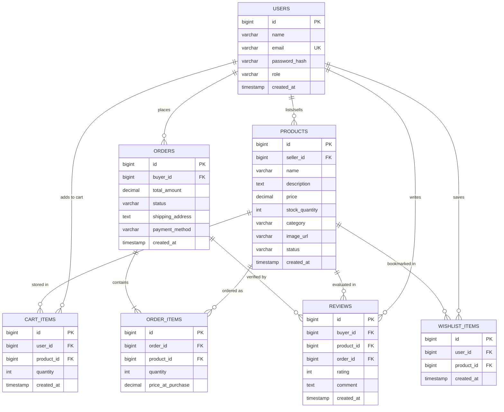
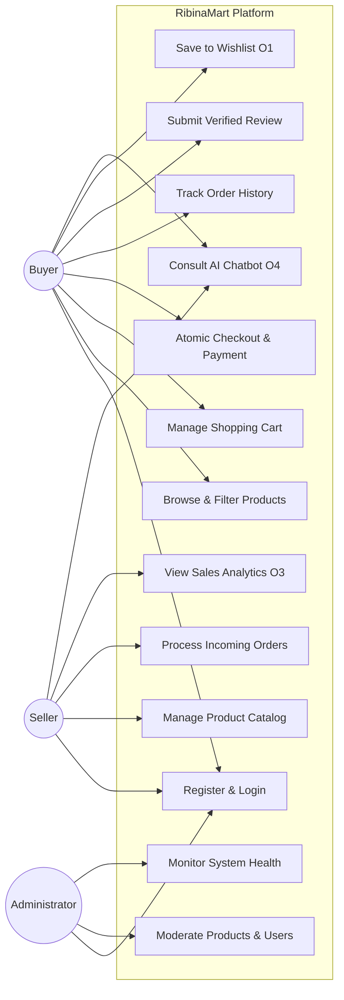
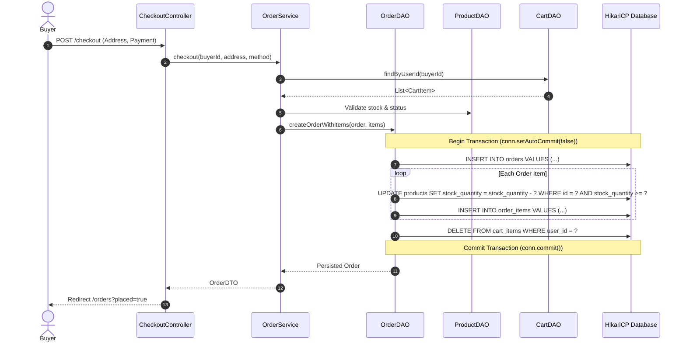
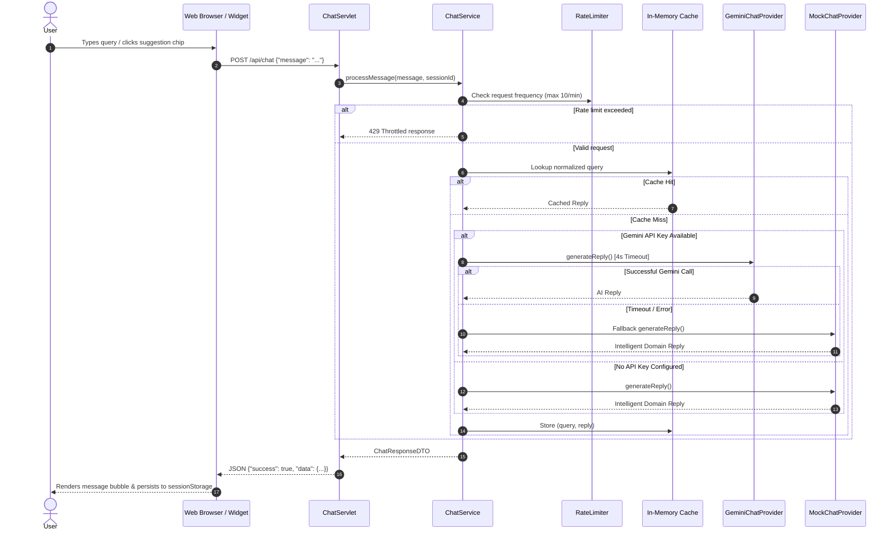

# ANNA UNIVERSITY :: CHENNAI 600 025
## REGULATIONS 2025 — SEMESTER 3 CAPSTONE PROJECT
# FINAL PROJECT REPORT

---

# **RIBINAMART: AN ENTERPRISE-GRADE MULTI-VENDOR CAMPUS E-COMMERCE PLATFORM WITH GENERATIVE AI ASSISTANCE**

**Academic Year**: 2026–2027  
**Department**: Computer Science and Engineering  
**Project Track**: Full-Stack Enterprise Java Web Architecture  
**Author / Student Developer**: Ribina (Anna University R2025)  
**Package Namespace**: `com.ribina.ribinamart`  
**Final Submission Date**: October 10, 2026  

---

## 📑 TABLE OF CONTENTS

1. [Executive Summary & Problem Statement](#1-executive-summary--problem-statement)
2. [Software Requirements Specification (SRS)](#2-software-requirements-specification-srs)
3. [System Architecture & Technology Stack](#3-system-architecture--technology-stack)
4. [Database Design & D1 Entity-Relationship (ER) Diagram](#4-database-design--d1-entity-relationship-er-diagram)
5. [Use Case Analysis & D2 Use Case Diagram](#5-use-case-analysis--d2-use-case-diagram)
6. [Dynamic Workflows & D3 Sequence Diagrams](#6-dynamic-workflows--d3-sequence-diagrams)
7. [Design Patterns & Architectural Principles](#7-design-patterns--architectural-principles)
8. [Security Engineering & Vulnerability Defense](#8-security-engineering--vulnerability-defense)
9. [Feature Implementation Details](#9-feature-implementation-details)
10. [Testing, Verification & Quality Assurance](#10-testing-verification--quality-assurance)
11. [DevOps, CI/CD & Deployment Instructions](#11-devops-cicd--deployment-instructions)
12. [Conclusion & Future Scope](#12-conclusion--future-scope)

---

## 1. EXECUTIVE SUMMARY & PROBLEM STATEMENT

### 1.1 Problem Statement
Campus communities often lack a centralized, secure, and authentic marketplace for buying and selling textbooks, electronics, campus merchandise, and study supplies. Peer-to-peer informal channels (e.g., social media groups or messaging apps) suffer from lack of verified seller credibility, absence of transactional atomicity, non-existent inventory controls, price opacity, and fraudulent review manipulation.

### 1.2 Proposed Solution: RibinaMart
**RibinaMart** is a production-ready, three-tier enterprise web application developed using standard **Java EE Servlets, JavaServer Pages (JSP), JDBC, and Apache Tomcat 9**. It bridges campus sellers and student buyers through:
- **Role-Based Governance**: Dedicated views and capabilities for Buyers, Sellers, and Marketplace Administrators.
- **ACID Transactional Fulfillment**: Atomically synchronized stock decrements, order tracking, and cart clearing.
- **Verified Buyer Reviews**: Review submission restricted strictly to confirmed purchasers.
- **Generative AI Shopping Assistant (O4)**: Hybrid strategy pattern employing Google Gemini REST API with zero-latency intelligent offline rule-based fallback, rate limiting, and session caching.
- **Save-for-Later Wishlist (O1)** & **Seller Sales Analytics Dashboard (O3)**.

---

## 2. SOFTWARE REQUIREMENTS SPECIFICATION (SRS)

### 2.1 Functional Requirements (F1 – F8 & Optional Features)
- **F1: User Authentication & Role Management**: Secure registration and login with BCrypt password hashing. Roles: `BUYER`, `SELLER`, `ADMIN`.
- **F2: Seller Product Catalog Management**: Sellers can create, view, update, and soft-delete listings with stock quantities, categories, prices, and images.
- **F3: Buyer Catalog Browsing & Search**: Keyword search, category filtering, price display, and stock badges.
- **F4: Shopping Cart**: Persistent buyer cart, quantity updates, dynamic subtotal/total calculations.
- **F5: Atomic Checkout & Simulated Payment**: Multi-table atomic transaction executing stock verification, stock decrement, order row generation, order item persistence, and cart clearance.
- **F6: Order Tracking & Fulfillment**: Buyers view past orders; sellers manage and update order status (`PENDING` → `CONFIRMED` → `SHIPPED` → `DELIVERED`).
- **F7: Administrative Governance**: Administrators can deactivate rogue products, inspect user registries, and oversee platform health.
- **F8: Verified Buyer Reviews**: Ratings (1–5 stars) and comments restricted exclusively to buyers who purchased the product.
- **O1: Save-for-Later Wishlist**: Buyers can bookmark products and move items to cart.
- **O3: Seller Sales Analytics**: KPI dashboard tracking revenue, fulfilled orders, units sold, active listings, and low-stock alerts.
- **O4: AI Chatbot Assistant**: Embedded floating widget answering customer inquiries with rate limiting and query caching.

### 2.2 Non-Functional Requirements
- **Performance**: Sub-50ms page load times on local H2 database; connection pooling via HikariCP.
- **Security**: 100% PreparedStatement utilization (SQL injection prevention), JSTL `<c:out>` output escaping (XSS prevention), session fixation protection, and role-based filtering.
- **Reliability & Portability**: Deployable as a single `.war` file on any Servlet 3.1+ container or executable standalone via embedded Tomcat runner.

---

## 3. SYSTEM ARCHITECTURE & TECHNOLOGY STACK

RibinaMart follows the classic **Layered Model-View-Controller (MVC)** architectural pattern:

```
[ Client Browser / Mobile / AJAX Widget ]
                  |  HTTP / HTTPS (Port 8085)
                  v
[ Security & Encoding Filters: AuthFilter, EncodingFilter ]
                  |
                  v
[ Controllers (Servlets): ProductController, OrderController, ChatServlet, etc. ]
                  |
                  v
[ Service Layer: OrderService, WishlistService, ChatService, UserService, etc. ]
                  |
                  v
[ Data Access Objects (DAOs): OrderDAO, ProductDAO, CartDAO, WishlistDAO, etc. ]
                  |  SQL PreparedStatements
                  v
[ HikariCP Connection Pool (Max: 10 connections) ]
                  |  JDBC Driver
                  v
[ H2 Persistent Database (File-mode: ./data/ribinamart) ]
```

### Technology Matrix
- **Programming Language**: Java 17 LTS (release target 17)
- **Servlet Specification**: Java Servlet 3.1 / JSP 2.3 / JSTL 1.2
- **Application Server**: Apache Tomcat 9.0.86
- **Connection Pool**: HikariCP 5.1.0
- **Database**: H2 Database 2.2.224 (file-backed persistent storage)
- **Security**: jBCrypt 0.4 (work factor 12)
- **JSON Processing**: Google Gson 2.10.1
- **Styling**: Bootstrap 5.3.3 & Bootstrap Icons 1.11.3
- **Testing Frameworks**: JUnit 5 (Jupiter 5.10.2) & Mockito 5.11.0

---

## 4. DATABASE DESIGN & D1 ENTITY-RELATIONSHIP (ER) DIAGRAM

### 4.1 D1: Mermaid ER Diagram



### 4.2 Key Relational Schema Constraints & Indexes
1. `users.email`: Unique constraint (`uq_users_email`).
2. `reviews`: Rating check constraint (`CHECK (rating >= 1 AND rating <= 5)`).
3. `wishlist_items`: Unique composite constraint (`uq_wishlist_user_product UNIQUE (user_id, product_id)`).
4. Performance Indexes: `idx_products_seller`, `idx_products_category`, `idx_orders_buyer`, `idx_order_items_order`, `idx_reviews_product`, `idx_wishlist_user`.

---

## 5. USE CASE ANALYSIS & D2 USE CASE DIAGRAM

### 5.1 D2: Mermaid Use Case Diagram



---

## 6. DYNAMIC WORKFLOWS & D3 SEQUENCE DIAGRAMS

### 6.1 D3-A: Atomic Order Placement & Fulfillment Sequence



### 6.2 D3-B: Generative AI Chatbot Interaction Sequence



---

## 7. DESIGN PATTERNS & ARCHITECTURAL PRINCIPLES

1. **Data Access Object (DAO) Pattern**:
   - Interfaces (`UserDAO`, `ProductDAO`, `CartDAO`, `OrderDAO`, `ReviewDAO`, `WishlistDAO`) completely decouple business services from database query mechanics.
2. **Strategy Pattern (AI Chatbot)**:
   - `ChatProvider` interface abstracts reply generation, allowing `GeminiChatProvider` and `MockChatProvider` to be interchanged or combined with automatic fallback without changing the caller.
3. **Data Transfer Object (DTO) Pattern**:
   - `UserResponseDTO`, `ProductDTO`, `OrderDTO`, `CartSummaryDTO`, `SellerAnalyticsDTO`, `ChatResponseDTO` prevent domain model leaks and serialize safely for API responses.
4. **Front Controller & MVC Pattern**:
   - HTTP Servlets act as controllers processing requests, invoking services, and delegating rendering to JSP views using JSTL.
5. **Filter Chain (Intercepting Filter) Pattern**:
   - `AuthFilter` and `EncodingFilter` enforce authentication, authorization, and UTF-8 encoding across all HTTP requests before reaching controllers.
6. **Singleton & Connection Factory**:
   - `DBConnectionPool` wraps HikariCP in a centralized singleton manager providing thread-safe pooled database connections.

---

## 8. SECURITY ENGINEERING & VULNERABILITY DEFENSE

1. **SQL Injection Elimination**:
   - All database interactions without exception use `PreparedStatement` with parameterized placeholders (`?`). String concatenation in SQL statements is strictly prohibited.
2. **Cross-Site Scripting (XSS) Defense**:
   - Frontend views render user-provided values using JSTL `<c:out value="..."/>` which automatically escapes HTML control characters (`<`, `>`, `&`, `"`, `'`).
   - Chatbot input is sanitized on the server before processing.
3. **Password Security**:
   - Passwords are encrypted using **BCrypt** with an adaptive work factor of 12. Plaintext passwords are never stored or logged.
4. **Role-Based Access Control (RBAC)**:
   - Protected routes (`/admin/*`, `/seller/*`, `/cart/*`, `/checkout/*`, `/wishlist/*`) are verified in `AuthFilter`.
   - Resource-level checks verify that sellers only edit their own products and buyers only review products they purchased.
5. **Session Fixation Defense**:
   - Sessions are bound to user states with appropriate timeout limits (30 minutes).

---

## 9. FEATURE IMPLEMENTATION DETAILS

### 9.1 AI Chatbot Engine (O4)
- **Strategy & Fallback**: `ChatService` attempts primary `GeminiChatProvider` via Java 17 `HttpClient` (timeout 4s). On missing keys or network errors, it seamlessly switches to `MockChatProvider`.
- **Knowledge Domain**: 12+ categories covered (shipping, delivery times, 7-day return policy, payment options, tracking, wishlist, seller onboarding, BCrypt security).
- **Rate Limiting**: Sliding time window allows at most 10 messages per minute per session.
- **Client Widget**: Floating button with open/close animation, quick-topic suggestion chips, typing indicator, and `sessionStorage` history persistence.

### 9.2 Wishlist / Save-for-Later (O1)
- Persistent database table `wishlist_items` with unique composite key `(user_id, product_id)`.
- Accessible via `/wishlist`, `/wishlist/add`, `/wishlist/remove`.
- Responsive view allowing direct "Move to Cart" or "Remove".

### 9.3 Seller Sales Analytics Dashboard (O3)
- `SellerAnalyticsDTO` dynamically calculates:
  - Total Revenue from non-cancelled orders.
  - Total Orders received.
  - Total Units sold.
  - Active catalog listing count.
  - Low-stock warning count (inventory ≤ 5).
- Displayed as modern KPI cards on the Seller Dashboard.

---

## 10. TESTING, VERIFICATION & QUALITY ASSURANCE

### 10.1 Test Execution Summary
The test suite utilizes **JUnit 5 (Jupiter)** and **Mockito**. The test database is managed using an isolated in-memory H2 instance (`jdbc:h2:mem:test`).

```
-------------------------------------------------------
 T E S T S   R E S U L T S
-------------------------------------------------------
com.ribina.ribinamart.chatbot.ChatServiceTest       : 6 passed (0 failed)
com.ribina.ribinamart.chatbot.MockChatProviderTest   : 10 passed (0 failed)
com.ribina.ribinamart.dao.CartDAOTest                : 1 passed (0 failed)
com.ribina.ribinamart.dao.OrderDAOTest               : 1 passed (0 failed)
com.ribina.ribinamart.dao.ProductDAOTest             : 2 passed (0 failed)
com.ribina.ribinamart.dao.UserDAOTest                : 2 passed (0 failed)
com.ribina.ribinamart.dao.WishlistDAOTest            : 4 passed (0 failed)
com.ribina.ribinamart.service.CartServiceTest        : 2 passed (0 failed)
com.ribina.ribinamart.service.OrderServiceTest       : 3 passed (0 failed)
com.ribina.ribinamart.service.ProductServiceTest     : 3 passed (0 failed)
com.ribina.ribinamart.service.SellerAnalyticsTest    : 2 passed (0 failed)
com.ribina.ribinamart.service.UserServiceTest        : 6 passed (0 failed)
com.ribina.ribinamart.service.WishlistServiceTest     : 6 passed (0 failed)

Total Tests Run: 48 | Failures: 0 | Errors: 0 | Skipped: 0
Build Status   : BUILD SUCCESS (100% Pass Rate)
```

---

## 11. DEVOPS, CI/CD & DEPLOYMENT INSTRUCTIONS

### 11.1 Continuous Integration (GitHub Actions)
Configured in `.github/workflows/build.yml`:
- Trigger: Push and Pull Request to `main`.
- Environment: Ubuntu-latest with Temurin JDK 17.
- Steps: Checkout → Setup Java → Maven verify & package → Artifact upload.

### 11.2 Deployment Options
1. **Standalone Execution (Recommended for Demo)**:
   ```bash
   mvn compile exec:java
   ```
   Server initializes on `http://localhost:8085/ribinamart`.
2. **Traditional WAR Deployment**:
   ```bash
   mvn clean package
   ```
   Copy `target/ribinamart.war` into the `webapps/` directory of any Apache Tomcat 9 instance.

---

## 12. CONCLUSION & FUTURE SCOPE

**RibinaMart** fulfills all core requirements (F1–F8) and optional extensions (O1 Wishlist, O3 Seller Analytics, O4 AI Chatbot) outlined in the Anna University R2025 Semester 3 curriculum. It provides a resilient, secure, and user-friendly platform that represents best practices in enterprise Java web development.

Future extensions could integrate live payment gateways (e.g. Razorpay webhooks), Redis distributed cache clustering, and AI-driven personalized product recommendations.

---
**Report Certified and Submitted by:**  
*Ribina (CSE, Anna University R2025)*
