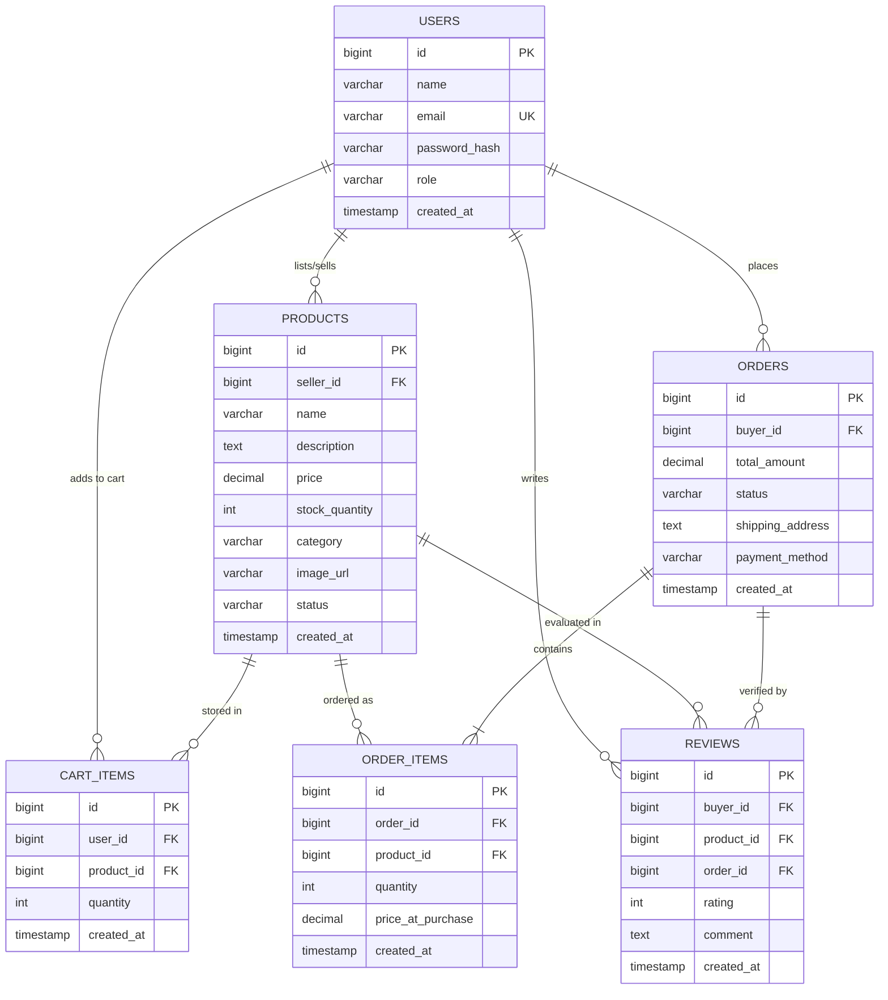
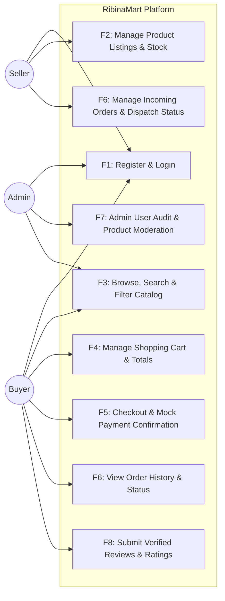
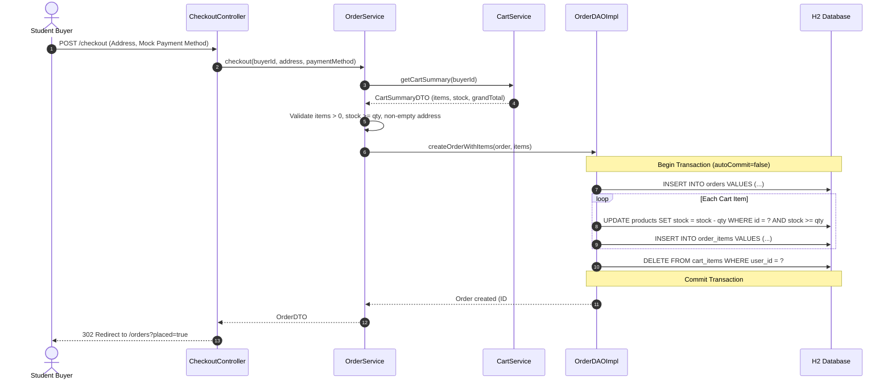

# RibinaMart — Campus E-Commerce Platform

[](.github/workflows/build.yml)
[](https://www.oracle.com/java/)
[](https://tomcat.apache.org/)
[](https://www.h2database.com/)
[]()
[]()

**Anna University R2025 Regulations — Semester 3 Capstone Project**  
**Milestone**: Final Review & Project Defense (October 10, 2026) — Release v2.0.0  
**Package**: `com.ribina.ribinamart`

---

## 📌 Executive Summary

**RibinaMart** is an enterprise-grade, multi-role e-commerce web platform engineered using standard **Java EE Servlets, JDBC, and Apache Tomcat 9**. It bridges campus merchants and student consumers with strict architectural layering, robust role-based security, atomic transactional order fulfillment, and verified review tracking.

---

## 🏗 System Architecture & Diagrams

### D1: Entity-Relationship (ER) Diagram



---

### D2: Use Case Diagram (F1 – F8)



---

### D3: Sequence Diagram (Place-Order Transaction Flow)



---

## 💻 Tech Stack Table

| Component | Technology | Version | Purpose |
| :--- | :--- | :--- | :--- |
| **Language** | Java (JDK) | 17 LTS | Core application runtime |
| **Web Container** | Apache Tomcat | 9.0.x (`javax.servlet.*`) | Servlet container & JSP engine |
| **Persistence** | H2 Database | 2.2.224 | Embedded persistent storage & in-memory test DB |
| **Connection Pool** | HikariCP | 5.1.0 | High-performance JDBC connection pool |
| **Security** | jBCrypt | 0.4 | Salted BCrypt password hashing |
| **JSON API** | Google Gson | 2.10.1 | Response serialization for `/api/v1/*` |
| **Testing** | JUnit 5 & Mockito | 5.10.2 / 5.11.0 | Unit tests and DAO integration test suite |
| **Frontend** | JSP, JSTL 1.2, Bootstrap 5 | 5.3.3 | Responsive UI with XSS output escaping |
| **Build & CI** | Apache Maven & GitHub Actions | 3.9+ | Build lifecycle and continuous integration |

---

## 🔑 Pre-Seeded Accounts for Evaluation

| Role | Email | Password | Pre-configured Data |
| :--- | :--- | :--- | :--- |
| **ADMIN** | `admin@ribinamart.com` | `Admin@123` | Platform oversight, user audits, and moderation |
| **SELLER 1** | `seller1@ribinamart.com` | `Seller@123` | TechHub Electronics (Electronics, Laptops, Accessories) |
| **SELLER 2** | `seller2@ribinamart.com` | `Seller@123` | PageTurner Bookstore (Engineering Textbooks, Journals) |
| **BUYER 1** | `buyer1@ribinamart.com` | `Buyer@123` | Active student buyer with completed delivered order & reviews |
| **BUYER 2** | `buyer2@ribinamart.com` | `Buyer@123` | Prospective buyer account |

---

## 🚀 Quickstart & Execution Guide

### Prerequisites
- JDK 17 or higher
- Apache Maven 3.8+

### 1. Run Automated Test Suite
```powershell
mvn clean test
```
*All 48 tests (embedded H2 DAO integration, Mockito service tests, and Chatbot tests) pass with 0 failures.*

### 2. Run Application (1-Click Standalone Embedded Tomcat)
```powershell
mvn compile exec:java
```
Or specify a custom port:
```powershell
mvn compile exec:java -Dserver.port=8085
```

The application will be accessible at:
- **Application Web UI**: [http://localhost:8085/ribinamart](http://localhost:8085/ribinamart)
- **Health Check Endpoint**: [http://localhost:8085/ribinamart/api/v1/health](http://localhost:8085/ribinamart/api/v1/health)
- **AI Chatbot Endpoint**: [http://localhost:8085/ribinamart/api/chat](http://localhost:8085/ribinamart/api/chat)
- **Product Catalog**: [http://localhost:8085/ribinamart/products](http://localhost:8085/ribinamart/products)

### 3. Deploy to External Tomcat 9.0.x
Build the WAR archive:
```powershell
mvn clean package
```
Deploy `target/ribinamart.war` to Tomcat's `webapps/` directory.

---

## 🛡️ Security Checklist Compliance

- [x] **100% Parameterized Queries**: Every database access in `UserDAOImpl`, `ProductDAOImpl`, `CartDAOImpl`, `OrderDAOImpl`, `ReviewDAOImpl`, and `WishlistDAOImpl` uses `PreparedStatement` with bind variables.
- [x] **BCrypt Password Hashing**: Plaintext passwords are never stored and never logged; hashed with `jBCrypt` (12 rounds of salt).
- [x] **Session Fixation Prevention**: Session ID is invalidated and regenerated upon successful login in `AuthController`.
- [x] **Role-Based Access Control**: `AuthFilter` intercepts and enforces authorization on `/seller/*`, `/admin/*`, `/cart/*`, `/checkout/*`, and `/wishlist/*`.
- [x] **Output Escaping (XSS Prevention)**: User input is rendered using JSTL `<c:out value="..."/>` and escaped before display.
- [x] **Custom Error Pages**: `web.xml` maps 403, 404, and 500 status codes to user-friendly JSP pages without stack trace leakage.
- [x] **Config File Exclusion**: Sensitive files and `.env` are excluded via `.gitignore`.
- [x] **Health Check Endpoint**: `GET /api/v1/health` returns `{"status":"UP","db":"UP"}`.

---

## 📋 Feature Implementation Matrix

- **F1: Authentication & RBAC**: Buyer and Seller registration; seeded Admin; BCrypt hashing; session timeout (30 min).
- **F2: Seller Inventory Management**: Create, edit, and soft-delete listings; live stock level monitoring.
- **F3: Catalog Search & Filter**: Filter by category chips; search by title and description; combined query support.
- **F4: Shopping Cart**: Real-time item additions, quantity updates, removal, and running grand total calculation.
- **F5: Checkout & Mock Payment**: Atomic multi-table checkout transaction; stock decrement; mock card/UPI confirmation.
- **F6: Order History & Fulfillment**: Buyer order tracking; seller incoming orders view with order fulfillment status update (`PENDING` -> `CONFIRMED` -> `SHIPPED` -> `DELIVERED`).
- **F7: Admin Governance**: Full user audit table; order audit; listing moderation (flag/unflag products).
- **F8: Verified Reviews & Ratings**: 1–5 star rating and comment submission restricted to verified purchasers of the product.
- **O1: Save-for-Later Wishlist**: Persistent buyer wishlist with one-click Add to Wishlist and Move to Cart.
- **O3: Seller Sales Analytics**: KPI dashboard tracking revenue, orders, units sold, active items, and low-stock alerts.
- **O4: AI Chatbot Assistant**: Embedded floating widget powered by Google Gemini API with offline domain mock fallback, rate limiting, and caching.

---

## 📚 Capstone Deliverables & Documentation Index

- 📄 **[Final Academic Project Report](FINAL_REPORT.md)**: Full formal report with D1 ER, D2 Use Case, D3 Sequence diagrams, and design patterns.
- 📽️ **[Viva Defense Slide Deck](SLIDE_DECK.md)**: 12-slide presentation deck with speaker notes.
- 🎬 **[Live Demo Script](DEMO_SCRIPT.md)**: Rehearsed step-by-step presentation script for demo day.
- 🧪 **[End-to-End Test Case Sheet](TEST_CASES.md)**: 22 detailed manual & automated test specifications.
- 🤝 **[Contributing Guidelines](CONTRIBUTING.md)**: Architecture, coding rules, and Git branching workflow.
- 🔁 **[Sprint Retrospective](RETRO.md)**: Retrospective report covering achievements, challenges, and metrics.
- ⚙️ **[Environment Template](.env.example)**: Production and development configuration template.

